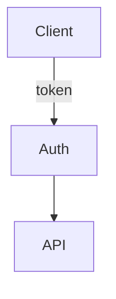
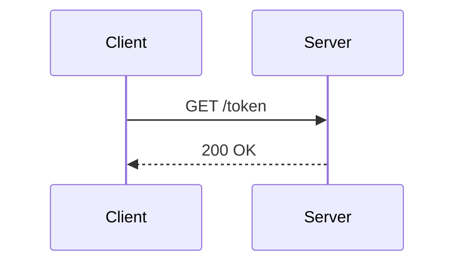

# Mermaid minimal patterns (own notes, not copied docs)

## Flowchart

## Sequence

## Failure modes to avoid
- `--<` is never valid. Use `-->`.
- `A --|label| B` needs full edge: `A -->|label| B`.
- Quote labels with commas/colons: `A["a, b: c"]`.
- Keep IDs stable: A, B, C. Labels can change, IDs must not drift.
- One name per thing: do not mix worker/agent/executor.

Full API: `mermaid.parse(text)` validates without rendering.
